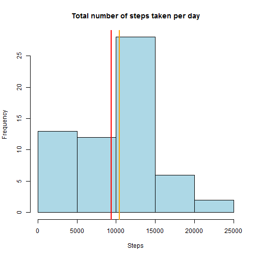
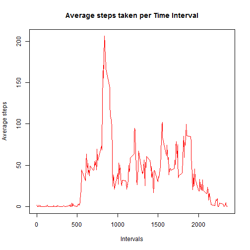
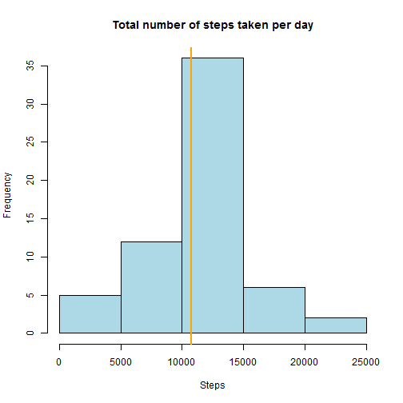
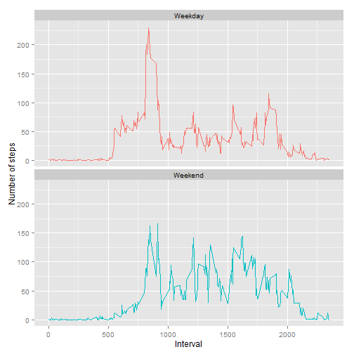

This assignment makes use of data from a personal activity monitoring device. This device collects data at 5 minute intervals through out the day. The data consists of two months of data from an anonymous individual collected during the months of October and November, 2012 and include the number of steps taken in 5 minute intervals each day.

### Data

The variables included in this dataset are:

steps: Number of steps taking in a 5-minute interval (missing values are coded as NA)

date: The date on which the measurement was taken in YYYY-MM-DD format

interval: Identifier for the 5-minute interval in which measurement was taken

The dataset is stored in a comma-separated-value (CSV) file and there are a total of 17,568 observations in this dataset.


```r
## Loading and preprocessing the data
activity <- read.csv("activity.csv", header=TRUE)

## format date 
activity$date <- as.Date(as.character(activity$date), "%Y-%m-%d")
```

### What is mean total number of steps taken per day?


```r
## count number of steps per day
aggdata <-aggregate(activity$steps, by=list(activity$date),"sum", na.rm=TRUE)

## Plot histogram of the total number of steps taken per day
hist(aggdata$x, col="lightblue", main="Total number of steps taken per day", xlab="Steps", ylab="Frequency")

## Adding mean and median steps per day
mean.steps <- mean(aggdata$x)
med.steps <- median(aggdata$x)
abline(v = mean.steps, col = "red", lwd = 2)
abline(v = med.steps, col = "orange", lwd = 2)
```

 

Note: The mean is a red line and the median is an orange line.

The mean number of steps taken per day is: 

```r
mean.steps
```

```
## [1] 9354.23
```
The median number of steps taken per day is: 

```r
med.steps
```

```
## [1] 10395
```

## What is the average daily activity pattern?


```r
## Calculate and plot the average steps taken per interval
avg.interval <-aggregate(activity$steps, by=list(activity$interval),FUN="mean", na.rm=TRUE)
plot(avg.interval$Group.1, avg.interval$x, type="l", col="red", main="Average steps taken per Time Interval", 
     xlab="Intervals", ylab="Average steps")
```

 

The 5-minute interval that contains the maximum number of steps


```r
avg.interval[which.max(avg.interval[,2]),1]
```

```
## [1] 835
```

## Imputing missing values

The total number of missing values in the dataset are:


```r
rowsNA <- activity[rowSums(is.na(activity)) > 0,]
nrow(rowsNA)
```

```
## [1] 2304
```

The strategy used for imputation is to fill in the missing NA values with the average steps for the given interval.


```r
## Filling in missing values in the dataset
activity[is.na(activity$steps),"steps"] = avg.interval[2]

## Using the new dataset to draw the same histogram
aggdata <-aggregate(activity$steps, by=list(activity$date),"sum", na.rm=TRUE)
## A histogram of the total number of steps taken per day
hist(aggdata$x, col="lightblue", main="Total number of steps taken per day", xlab="Steps", ylab="Frequency")

## Adding mean and median steps per day
mean.steps <- mean(aggdata$x)
med.steps <- median(aggdata$x)
abline(v = mean.steps, col = "red", lwd = 2)
abline(v = med.steps, col = "orange", lwd = 2)
```

 

Note: The mean is a red line and the median is an orange line.

The mean number of steps taken per day is: 

```r
mean.steps
```

```
## [1] 10766.19
```
The median number of steps taken per day is: 

```r
med.steps
```

```
## [1] 10766.19
```

The impact of imputing missing data on the estimates of the total daily number of steps is that the data has a wider distribution and the mean and median are the same.

## Are there differences in activity patterns between weekdays and weekends?


```r
##Adding a factor for weekday or weekend
activity$wday <- weekdays(activity$date)
activity$wend <- as.factor(ifelse(activity$wday %in% c("Saturday","Sunday"), "Weekend", "Weekday"))
avg.wday <-aggregate(activity$steps, by=list(activity$wend,activity$interval),FUN="mean", na.rm=TRUE)

## panel plot containing a time series plot
library(ggplot2, quietly=TRUE)
ggplot(avg.wday,aes(x=Group.2,y=x,colour=Group.1,group=Group.1)) + geom_line() + facet_wrap( ~ Group.1, nrow=2) + 
  xlab("Interval") + ylab("Number of steps") + theme(legend.position = "none")
```

 
